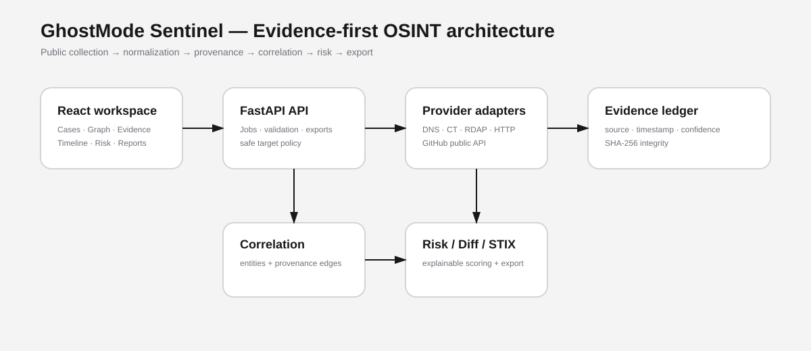

# GhostMode Sentinel — Open-Source OSINT Investigation Platform

> A privacy-first, evidence-centric OSINT workspace for defensive research, digital-footprint audits, brand monitoring, incident triage, and authorized attack-surface intelligence.



## Why this exists

GhostMode Sentinel is the next-generation version of GhostMode: not a fake “search box”, but a local-first investigation workbench that turns **public-source collection → normalized evidence → correlation → confidence → risk → timeline → report** into one workflow.

It is designed as an open-source alternative to fragmented OSINT workflows. It deliberately emphasizes **provenance and analyst judgment** instead of pretending every discovered string is a fact.

### Core differentiators

- **Evidence Ledger:** every observation stores source, retrieval time, method, confidence, and SHA-256 integrity hash.
- **Temporal Diffing:** compare two collection snapshots and surface new, removed, changed, and stale evidence.
- **Correlation Engine:** connect domains, subdomains, certificate names, GitHub identities, usernames, technologies, and sources without treating correlation as proof.
- **Confidence-aware graph:** relationships carry confidence and provenance instead of being anonymous lines on a canvas.
- **Risk model:** exposure score combines severity, confidence, freshness, and blast radius; it is explicitly heuristic.
- **STIX 2.1 export:** convert normalized findings into an interoperable threat-intelligence bundle.
- **Safe passive collection:** no credential harvesting, authentication bypass, exploitation, stealth, port scanning, or private-network probing.
- **Provider architecture:** public collectors are isolated adapters, so contributors can add sources without rewriting the core.
- **Case-centric workflow:** investigations, notes, evidence, hypotheses, tasks, and reports live together.
- **Explainability-first:** the UI shows *why* a finding exists and *what source supports it*.

## Current collectors

The bundled backend implements safe public-source collectors for:

| Collector | Input | Output |
|---|---|---|
| DNS-over-HTTPS | Domain | A/AAAA/CNAME/MX/NS/TXT |
| Certificate Transparency | Domain | certificate names / SAN relationships |
| RDAP | Domain | registration metadata when publicly returned |
| HTTP metadata | URL/domain | status, headers, security headers, title, robots/security.txt presence |
| GitHub public API | username / org / repo | public profile/repository metadata |

Collectors are intentionally conservative. They use public endpoints and normal HTTP requests; they do not log in, bypass access controls, exploit targets, or perform active port/service enumeration.

## Product surfaces

### 01 — Command Center

- investigation health
- evidence count
- high-risk findings
- source freshness
- collection activity
- recommended next actions

### 02 — Investigations

- create cases
- define authorized scope
- record hypothesis and objective
- track tasks
- keep analyst notes

### 03 — Collection Studio

Choose a target type and a safe collection profile. Every run produces a job ID and an evidence ledger.

### 04 — Evidence Ledger

Filter by:

- entity type
- source
- severity
- confidence
- freshness
- status

Open an item to inspect its provenance and integrity hash.

### 05 — Intelligence Graph

The graph is generated from evidence, not manually invented relationships. Each edge can be traced back to supporting observations.

### 06 — Timeline / Diff

Run a collection again later and compare snapshots. GhostMode Sentinel highlights:

- NEW
- CHANGED
- REMOVED
- STALE

### 07 — Risk & Exposure

Rank findings by an explainable heuristic and expose the underlying factors.

### 08 — Reports

Generate Markdown/JSON/STIX exports for handoff, documentation, or further analysis.

## Architecture

```text
                         ┌──────────────────────────┐
                         │     React / Vite UI       │
                         │ Command Center · Graph    │
                         │ Evidence · Timeline      │
                         └────────────┬─────────────┘
                                      │ REST
                         ┌────────────▼─────────────┐
                         │      FastAPI API          │
                         │ Cases · Jobs · Findings  │
                         │ Risk · Diff · Reports    │
                         └────────────┬─────────────┘
                                      │
                ┌─────────────────────┼────────────────────┐
                ▼                     ▼                    ▼
        ┌──────────────┐     ┌────────────────┐   ┌──────────────┐
        │ Provider SDK │     │ Correlation     │   │ Evidence     │
        │ DNS / CT /   │     │ + confidence    │   │ ledger +     │
        │ RDAP / HTTP  │     │ + risk engine   │   │ SHA-256      │
        └──────┬───────┘     └────────┬────────┘   └──────┬───────┘
               │                      │                   │
               └──────────────────────┼───────────────────┘
                                      ▼
                             ┌──────────────────┐
                             │ SQLite / JSON    │
                             │ local-first      │
                             └──────────────────┘
```

## Quick start — full stack

### Windows PowerShell

```powershell
cd GhostMode-Sentinel-OSINT
python -m venv .venv
.\.venv\Scripts\Activate.ps1
pip install -r backend/requirements.txt

# terminal 1
uvicorn backend.app.main:app --reload --port 8000

# terminal 2
cd frontend
npm install
npm run dev
```

Open `http://localhost:5173`.

The API is available at `http://localhost:8000/docs`.

### Linux/macOS

```bash
python3 -m venv .venv
source .venv/bin/activate
pip install -r backend/requirements.txt
uvicorn backend.app.main:app --reload --port 8000

cd frontend
npm install
npm run dev
```

## Docker

```bash
docker compose up --build
```

Frontend: `http://localhost:5173`
API: `http://localhost:8000/docs`

## Frontend-only deployment

The UI can be deployed to Vercel/Netlify, but **live OSINT collection requires the FastAPI backend**. A static Vercel deployment cannot safely execute server-side provider requests or keep API secrets.

Recommended production topology:

```text
Vercel / Netlify             Backend host
┌───────────────┐            ┌────────────────────┐
│ React frontend│ ── HTTPS → │ FastAPI + database │
└───────────────┘            └────────────────────┘
```

For a public deployment, set `VITE_API_BASE_URL` to the HTTPS API URL. Never put provider secrets in frontend environment variables.

## Configuration

`backend/.env.example` documents optional configuration. The baseline project does not require paid API keys.

## Data model

Each finding is represented as a normalized record:

```json
{
  "id": "finding-...",
  "entity_type": "subdomain",
  "value": "api.example.com",
  "source": "crt.sh",
  "source_url": "https://...",
  "observed_at": "2026-10-08T12:00:00Z",
  "confidence": 0.94,
  "severity": "medium",
  "evidence": {"raw": "..."},
  "sha256": "..."
}
```

The UI never turns a source observation into an unquestionable fact. Confidence is metadata, not truth.

## Safety model

GhostMode Sentinel is intended for:

- your own domains and accounts
- organizations where you have authorization
- public-source journalism and research within applicable law
- defensive security assessments
- brand and exposure monitoring

It intentionally does **not** implement:

- credential theft or phishing
- authentication bypass
- exploit delivery
- stealth/evasion
- port scanning or service exploitation
- private-network discovery
- scraping behind login walls
- automated account takeover or deletion

The application validates targets and blocks loopback/private IP ranges by default for URL collection.

## Roadmap

- pluggable provider marketplace
- PostgreSQL persistence
- background job queue
- scheduled authorized monitoring
- richer STIX relationship mapping
- browser-extension evidence capture with user action
- optional HIBP integration using a user-supplied API key
- OCR/document metadata module for files the analyst explicitly imports
- collaborative case workspaces

## Competitive positioning

SpiderFoot already offers broad automated OSINT collection and many modules, while Maltego emphasizes graph/link analysis and connectors. GhostMode Sentinel is deliberately different in emphasis: it makes **evidence provenance, temporal change, confidence, safe collection boundaries, explainable risk, and interoperable export** first-class concepts instead of adding another giant pile of sources.

## Resume bullet

> Built GhostMode Sentinel, an open-source OSINT investigation platform with a FastAPI provider architecture, evidence-provenance ledger, SHA-256 integrity hashing, confidence-aware entity correlation, temporal diffing, explainable exposure scoring, STIX 2.1 export, Docker deployment, and a React/Vite investigation workspace for authorized public-source research.

## License

MIT. See `LICENSE`.

## Responsible use

Only investigate targets you own or are explicitly authorized to assess. Public availability does not automatically mean unrestricted collection or processing is lawful in every jurisdiction.

## Windows troubleshooting (Python 3.14)

This release supports Python 3.14. The previous package pinned an older Pydantic release whose `pydantic-core` did not have a CPython 3.14 Windows wheel, which forced a Rust build. The runtime pins are now updated to Pydantic 2.12.5 and current FastAPI/Uvicorn releases.

### Clean reinstall

```cmd
cd D:\Projects\TECH\GhostMode-Sentinel-OSINT-FINAL\GhostMode-Sentinel-OSINT
deactivate
rmdir /s /q .venv
py -3.14 -m venv .venv\.venv\Scripts\activate
python -m pip install --upgrade pip
pip install -r backend\requirements.txt

cd frontend
npm install
npm run build
```

Start backend from the repository root:

```cmd
cd D:\Projects\TECH\GhostMode-Sentinel-OSINT-FINAL\GhostMode-Sentinel-OSINT
.venv\Scripts\activate
python -m uvicorn backend.app.main:app --reload --port 8000
```

Start frontend in a second terminal:

```cmd
cd D:\Projects\TECH\GhostMode-Sentinel-OSINT-FINAL\GhostMode-Sentinel-OSINT\frontend
npm run dev
```

Do not run `python -m venv .venv` while the existing virtual environment is active. Do not append another command to the Uvicorn command; run commands on separate lines.
